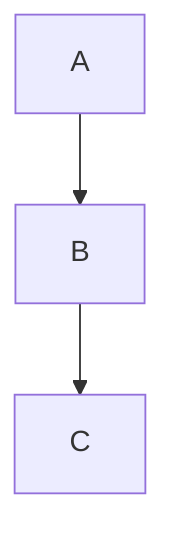
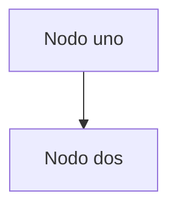
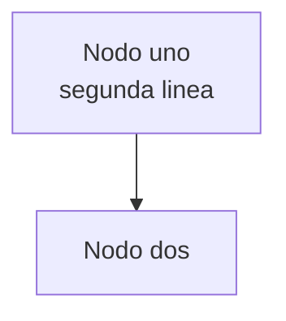
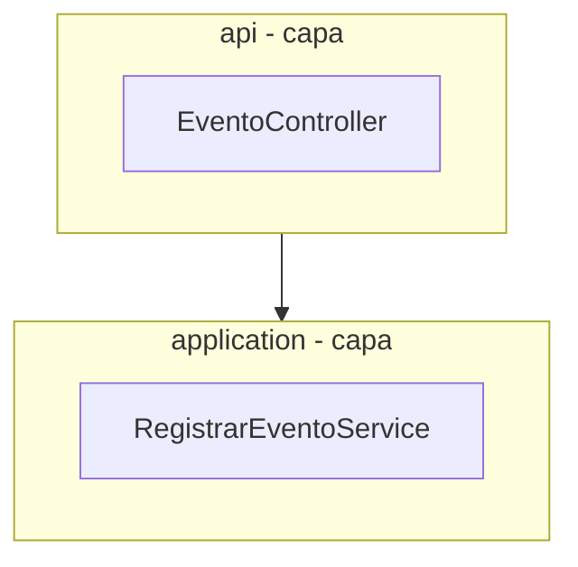
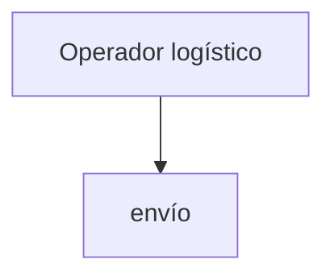

# Prueba A: sin br, sin comillas

```mermaid
graph TD
    A --> B
    B --> C
```

# Prueba B: con comillas, sin br

```mermaid
graph TD
    A["Nodo uno"] --> B["Nodo dos"]
```

# Prueba C: con br

```mermaid
graph TD
    A["Nodo uno<br/>segunda linea"] --> B["Nodo dos"]
```

# Prueba D: subgraph con id y titulo entre comillas

```mermaid
graph TD
    subgraph API["api - capa"]
        EC["EventoController"]
    end
    subgraph APP["application - capa"]
        UC["RegistrarEventoService"]
    end
    API --> APP
```

# Prueba E: acentos

```mermaid
graph TD
    A["Operador logístico"] --> B["envío"]
```
