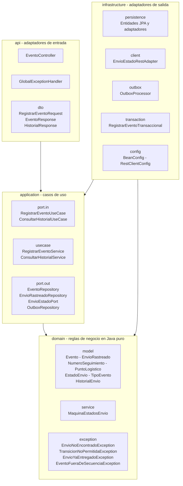
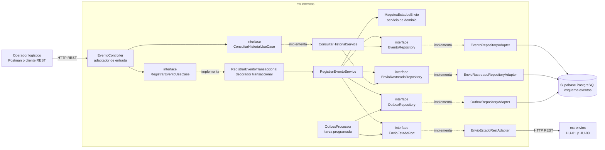
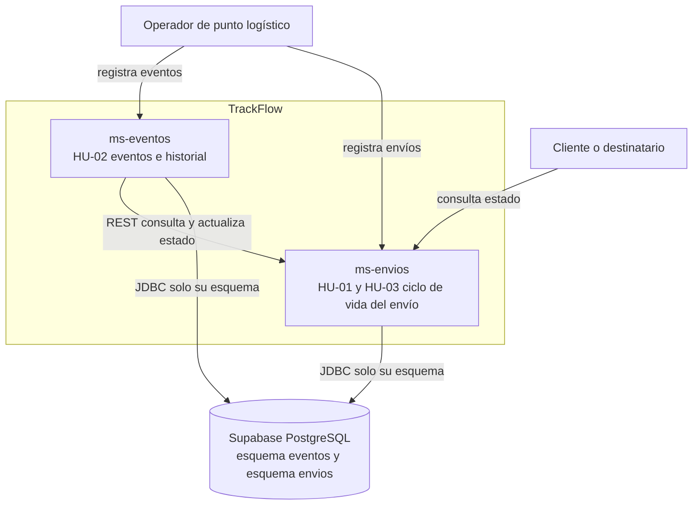
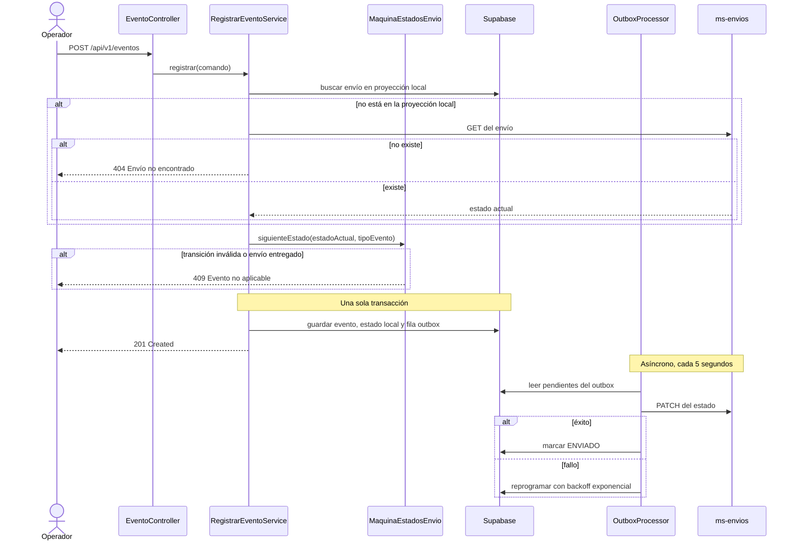

# Diagramas de paquetes y componentes — ms-eventos

Microservicio de eventos logísticos de TrackFlow (HU-02). Los diagramas reflejan el código tal como está implementado, no un diseño aspiracional.

- **Responsable:** Eyner Gómez Quintero
- **Fecha:** 2026-09-13
- **Sprint:** 1

---

## 1. Diagrama de paquetes

Clean Architecture: las dependencias apuntan **siempre hacia adentro**. El dominio no conoce a nadie; la infraestructura conoce a todos.

**Regla de dependencias verificable:** ninguna clase de `domain` ni de `application` importa `org.springframework` ni `jakarta.persistence`. Los beans se instancian a mano en `infrastructure/config/BeanConfig.java`, y la frontera transaccional vive en el decorador `RegistrarEventoTransaccional`, no en el caso de uso.

---

## 2. Diagrama de componentes con interfaces

Cada puerto es una interfaz explícita. Los adaptadores son intercambiables sin tocar el núcleo (DIP).

### Interfaces expuestas (provided)

| Interfaz | Operación | Consumidor |
|---|---|---|
| `POST /api/v1/eventos` | Registrar un evento logístico y mover el estado del envío | Operador del punto logístico |
| `GET /api/v1/envios/{numeroSeguimiento}/eventos` | Consultar el historial y el estado actual | Operador, Calidad |
| `GET /actuator/health` | Sonda de salud | Render, monitoreo |

### Interfaces consumidas (required)

| Interfaz | Proveedor | Uso |
|---|---|---|
| `GET /api/v1/envios/{numeroSeguimiento}` | `ms-envios` | Hidratar la proyección local cuando el envío aún no se conoce |
| `PATCH /api/v1/envios/{numeroSeguimiento}/estado` | `ms-envios` | Propagar el cambio de estado (asíncrono, vía outbox, con `idEvento` como clave de idempotencia) |

### Puertos internos (interfaces de la capa `application`)

| Puerto | Tipo | Implementación | Ubicación |
|---|---|---|---|
| `RegistrarEventoUseCase` | Entrada | `RegistrarEventoTransaccional` → `RegistrarEventoService` | `application/port/in/` |
| `ConsultarHistorialUseCase` | Entrada | `ConsultarHistorialService` | `application/port/in/` |
| `EventoRepository` | Salida | `EventoRepositoryAdapter` (JPA) | `application/port/out/` |
| `EnvioRastreadoRepository` | Salida | `EnvioRastreadoRepositoryAdapter` (JPA) | `application/port/out/` |
| `OutboxRepository` | Salida | `OutboxRepositoryAdapter` (JPA) | `application/port/out/` |
| `EnvioEstadoPort` | Salida | `EnvioEstadoRestAdapter` (HTTP) | `application/port/out/` |

---

## 3. Vista de contexto (C4 nivel 1)

Ubica a `ms-eventos` dentro de la solución TrackFlow.

**Regla dura:** cada microservicio accede **únicamente a su propio esquema**. `ms-eventos` nunca lee las tablas de `ms-envios` por SQL; toda información ajena entra por su API REST. Ver [ADR-003](../adr/ADR-003-persistencia-esquema-por-servicio.md).

---

## 4. Flujo de registro de un evento

El punto clave: el `201` se devuelve **antes** de hablar con `ms-envios`. Si ese servicio está caído, el evento igual queda registrado y la sincronización se recupera sola. Ver [ADR-002](../adr/ADR-002-integracion-resiliente-ms-envios.md).
