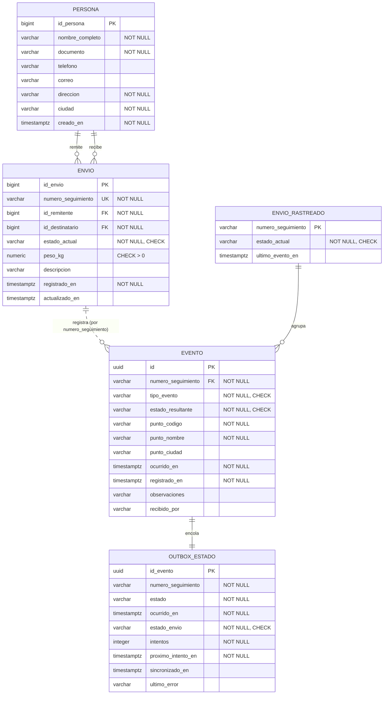
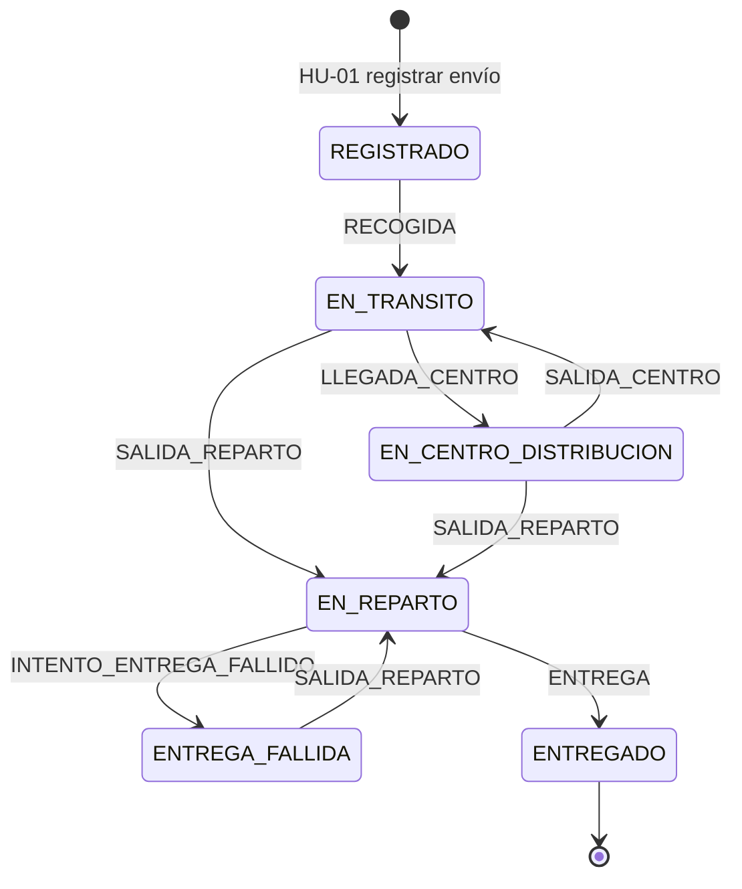

# Modelo de datos — TrackFlow

- **Responsable:** Eyner Gómez Quintero
- **Fecha:** 2026-09-13
- **Sprint:** 1

> **Nota para el equipo de Bases de Datos (Alejandro Botero, José Manuel Londoño, Iván López):** este documento es una **propuesta base** derivada del modelo ya implementado en `ms-eventos`, no un reemplazo del entregable del curso de Bases de Datos. El esquema `eventos` está materializado y funcionando en Supabase; el esquema `envios` es una propuesta a partir de los criterios de aceptación de HU-01 y HU-03, que ustedes y el equipo de `ms-envios` deben validar y refinar.

---

## 1. Entidades y relaciones

TrackFlow gestiona el ciclo de vida de un envío dentro de una red logística. Dos microservicios, dos esquemas, sin acceso cruzado por SQL (ver [ADR-003](../adr/ADR-003-persistencia-esquema-por-servicio.md)).

| Entidad | Esquema | Descripción |
|---|---|---|
| `envio` | `envios` | El paquete registrado, con su número de seguimiento único y su estado actual |
| `persona` | `envios` | Remitente o destinatario de un envío |
| `evento` | `eventos` | Cada movimiento del envío por un punto de la cadena logística |
| `envio_rastreado` | `eventos` | Proyección local del estado del envío, para que `ms-eventos` opere sin depender de `ms-envios` |
| `outbox_estado` | `eventos` | Cola de cambios de estado pendientes de propagar a `ms-envios` |

### Relaciones y cardinalidades

- Un **envío** tiene exactamente **un remitente** y **un destinatario** (dos referencias a `persona`). Una **persona** puede participar en **muchos** envíos.
- Un **envío** tiene **cero o muchos eventos**; cada **evento** pertenece a **exactamente un envío**. Un envío recién registrado aún no tiene eventos.
- Cada **evento** genera **una fila en el outbox**; cada fila del outbox corresponde a **un evento** (relación 1:1).
- Un **envío rastreado** agrupa **cero o muchos eventos** dentro del esquema `eventos`.

> La relación entre `envio` (esquema `envios`) y `evento` (esquema `eventos`) es **lógica, por número de seguimiento**, no una llave foránea física: cruzar esquemas con una FK acoplaría los dos microservicios y rompería su independencia de despliegue.

## 2. Diagrama entidad-relación



## 3. Máquina de estados del envío

El campo `estado_actual` no toma cualquier valor: está restringido por un `CHECK` y gobernado por las transiciones que implementa `MaquinaEstadosEnvio`.



`ENTREGADO` es **terminal**: cualquier evento posterior se rechaza con `409`.

## 4. Preguntas clave de negocio

Consultas que el modelo debe poder responder. Todas se resuelven contra las tablas de [`schema.sql`](schema.sql).

### P1. ¿Dónde está y qué le ha pasado a un envío? *(filtro + orden — HU-03)*

```sql
SELECT e.tipo_evento, e.estado_resultante, e.punto_nombre,
       e.punto_ciudad, e.ocurrido_en, e.recibido_por
FROM   eventos.evento e
WHERE  e.numero_seguimiento = 'TRK-SEED-0001'
ORDER  BY e.ocurrido_en;
```

### P2. ¿Cuánto tarda en promedio un envío entre la recogida y la entrega? *(agregación + join + filtro temporal)*

```sql
SELECT ROUND(AVG(EXTRACT(EPOCH FROM (entrega.ocurrido_en - recogida.ocurrido_en)) / 3600), 2)
           AS horas_promedio_transito,
       COUNT(*) AS envios_entregados
FROM   eventos.evento recogida
JOIN   eventos.evento entrega
       ON entrega.numero_seguimiento = recogida.numero_seguimiento
      AND entrega.tipo_evento = 'ENTREGA'
WHERE  recogida.tipo_evento = 'RECOGIDA'
  AND  entrega.ocurrido_en >= NOW() - INTERVAL '30 days';
```

### P3. ¿Qué envíos llevan más de 48 horas sin movimiento? *(detección de retrasos — filtro compuesto)*

```sql
SELECT er.numero_seguimiento, er.estado_actual, er.ultimo_evento_en,
       ROUND(EXTRACT(EPOCH FROM (NOW() - er.ultimo_evento_en)) / 3600) AS horas_sin_movimiento
FROM   eventos.envio_rastreado er
WHERE  er.estado_actual <> 'ENTREGADO'
  AND  er.ultimo_evento_en < NOW() - INTERVAL '48 hours'
ORDER  BY er.ultimo_evento_en;
```

### P4. ¿Qué volumen maneja cada punto logístico y cuántas entregas falla? *(agregación + agrupación + conteo condicional)*

```sql
SELECT e.punto_codigo, e.punto_nombre, e.punto_ciudad,
       COUNT(*) AS eventos_totales,
       COUNT(*) FILTER (WHERE e.tipo_evento = 'INTENTO_ENTREGA_FALLIDO') AS intentos_fallidos,
       COUNT(*) FILTER (WHERE e.tipo_evento = 'ENTREGA')                 AS entregas_exitosas
FROM   eventos.evento e
GROUP  BY e.punto_codigo, e.punto_nombre, e.punto_ciudad
HAVING COUNT(*) > 0
ORDER  BY eventos_totales DESC;
```

### P5. ¿Qué cambios de estado no se han podido sincronizar con ms-envios? *(operación — filtro sobre el outbox)*

```sql
SELECT o.numero_seguimiento, o.estado, o.intentos,
       o.proximo_intento_en, o.ultimo_error
FROM   eventos.outbox_estado o
WHERE  o.estado_envio <> 'ENVIADO'
ORDER  BY o.intentos DESC, o.proximo_intento_en;
```

### P6. ¿Cuántos envíos hay por estado y ciudad de destino? *(join entre esquemas — solo para reportes analíticos)*

```sql
SELECT p.ciudad AS ciudad_destino, en.estado_actual, COUNT(*) AS total
FROM   envios.envio en
JOIN   envios.persona p ON p.id_persona = en.id_destinatario
GROUP  BY p.ciudad, en.estado_actual
ORDER  BY p.ciudad, total DESC;
```

> P6 cruza solo tablas del esquema `envios`. Un reporte que necesite datos de ambos esquemas (por ejemplo, tiempos de tránsito por ciudad) corresponde a la épica E4 — Reportes Operativos del Sprint 3, y deberá resolverse con una vista de lectura dedicada, no con acceso cruzado desde los microservicios.

## 5. Modelo lógico

Normalizado hasta **3FN**: no hay grupos repetitivos, todos los atributos no clave dependen de la clave completa, y no hay dependencias transitivas (los datos de la persona viven en `persona`, no repetidos en `envio`).

### Esquema `envios` (propuesta — HU-01 y HU-03)

**persona**

| Columna | Tipo | Restricción |
|---|---|---|
| `id_persona` | `BIGINT` | PK, identidad |
| `nombre_completo` | `VARCHAR(150)` | NOT NULL |
| `documento` | `VARCHAR(30)` | NOT NULL |
| `telefono` | `VARCHAR(30)` | |
| `correo` | `VARCHAR(150)` | CHECK formato |
| `direccion` | `VARCHAR(200)` | NOT NULL |
| `ciudad` | `VARCHAR(100)` | NOT NULL |
| `creado_en` | `TIMESTAMPTZ` | NOT NULL, default `NOW()` |

**envio**

| Columna | Tipo | Restricción |
|---|---|---|
| `id_envio` | `BIGINT` | PK, identidad |
| `numero_seguimiento` | `VARCHAR(30)` | **UNIQUE**, NOT NULL, CHECK formato |
| `id_remitente` | `BIGINT` | FK → `persona`, NOT NULL |
| `id_destinatario` | `BIGINT` | FK → `persona`, NOT NULL, CHECK ≠ remitente |
| `estado_actual` | `VARCHAR(30)` | NOT NULL, CHECK en catálogo |
| `peso_kg` | `NUMERIC(8,3)` | CHECK > 0 |
| `descripcion` | `VARCHAR(300)` | |
| `registrado_en` | `TIMESTAMPTZ` | NOT NULL, default `NOW()` |
| `actualizado_en` | `TIMESTAMPTZ` | |

### Esquema `eventos` (implementado)

**evento**

| Columna | Tipo | Restricción |
|---|---|---|
| `id` | `UUID` | PK (generado en el dominio, no en la BD) |
| `numero_seguimiento` | `VARCHAR(30)` | FK → `envio_rastreado`, NOT NULL |
| `tipo_evento` | `VARCHAR(40)` | NOT NULL, CHECK en catálogo |
| `estado_resultante` | `VARCHAR(40)` | NOT NULL, CHECK en catálogo |
| `punto_codigo` | `VARCHAR(40)` | NOT NULL |
| `punto_nombre` | `VARCHAR(150)` | NOT NULL |
| `punto_ciudad` | `VARCHAR(100)` | |
| `ocurrido_en` | `TIMESTAMPTZ` | NOT NULL — cuándo pasó en la realidad |
| `registrado_en` | `TIMESTAMPTZ` | NOT NULL — cuándo lo supo el sistema |
| `observaciones` | `VARCHAR(500)` | |
| `recibido_por` | `VARCHAR(150)` | Solo se diligencia en `ENTREGA` |

La separación entre `ocurrido_en` y `registrado_en` es deliberada: permite auditar desfases entre el hecho físico y su registro, y es la base de la regla que rechaza eventos fuera de secuencia.

**envio_rastreado**

| Columna | Tipo | Restricción |
|---|---|---|
| `numero_seguimiento` | `VARCHAR(30)` | PK |
| `estado_actual` | `VARCHAR(40)` | NOT NULL, CHECK en catálogo |
| `ultimo_evento_en` | `TIMESTAMPTZ` | Nulo hasta el primer evento |

**outbox_estado**

| Columna | Tipo | Restricción |
|---|---|---|
| `id_evento` | `UUID` | PK, FK → `evento` |
| `numero_seguimiento` | `VARCHAR(30)` | NOT NULL |
| `estado` | `VARCHAR(40)` | NOT NULL |
| `ocurrido_en` | `TIMESTAMPTZ` | NOT NULL |
| `estado_envio` | `VARCHAR(20)` | NOT NULL, CHECK (`PENDIENTE`/`ENVIADO`/`FALLIDO`) |
| `intentos` | `INTEGER` | NOT NULL, CHECK ≥ 0 |
| `proximo_intento_en` | `TIMESTAMPTZ` | NOT NULL |
| `sincronizado_en` | `TIMESTAMPTZ` | |
| `ultimo_error` | `VARCHAR(1000)` | |

## 6. Modelo físico

El script ejecutable está en [`schema.sql`](schema.sql).

### Índices y su justificación

| Índice | Tabla | Justificación |
|---|---|---|
| `idx_evento_seguimiento_fecha` | `evento (numero_seguimiento, ocurrido_en)` | Resuelve P1 (historial ordenado) sin ordenamiento adicional; es la consulta más frecuente del servicio |
| `idx_outbox_pendientes` | `outbox_estado (estado_envio, proximo_intento_en)` | El `OutboxProcessor` corre cada 5 s buscando pendientes vencidos; sin índice haría un scan completo en cada ciclo |
| `idx_envio_rastreado_pendientes` | `envio_rastreado (estado_actual, ultimo_evento_en)` | Resuelve P3 (envíos sin movimiento) filtrando por estado y fecha |
| `idx_envio_estado` | `envio (estado_actual)` | Soporta reportes por estado (P6) |
| `idx_persona_documento` | `persona (documento)` | Búsqueda de remitente/destinatario al registrar un envío (HU-01) |

`numero_seguimiento` tiene índice implícito por ser `UNIQUE` en `envio` y PK en `envio_rastreado`: no se crea uno adicional para evitar índices redundantes (lineamiento 5.3).

### Estimación preliminar de volumen

| Tabla | Filas/mes estimadas | Supuesto |
|---|---|---|
| `envio` | ~5.000 | Volumen académico de demostración |
| `evento` | ~25.000 | Promedio de 5 eventos por envío a lo largo de su ciclo |
| `outbox_estado` | ~25.000 | Uno por evento; candidatas a purga tras 30 días en `ENVIADO` |

A este volumen no se justifica particionamiento (lineamiento 5.3). Se revisará en el Sprint 3 con datos reales de uso.

## 7. Trazabilidad con las historias de usuario

| Historia | Tablas involucradas | Consulta clave |
|---|---|---|
| HU-01 — Registrar envío | `envios.persona`, `envios.envio` | Inserción con generación de `numero_seguimiento` |
| HU-02 — Registrar evento | `eventos.evento`, `eventos.envio_rastreado`, `eventos.outbox_estado` | P1, P5 |
| HU-03 — Consultar estado | `envios.envio`, `eventos.evento` | P1 |
| E4 — Reportes (Sprint 3) | Todas | P2, P3, P4, P6 |
